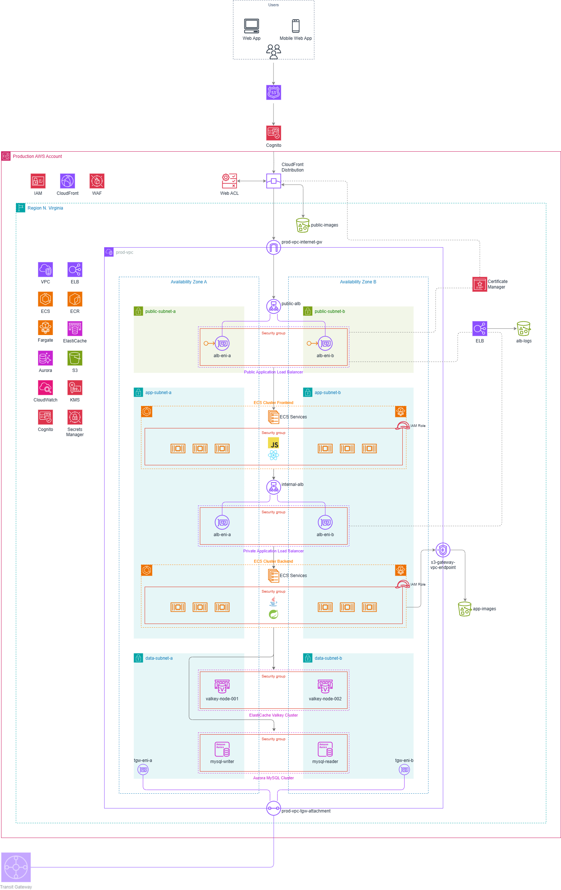

# Ferovinum Infrastructure Design (AWS-Based Microservices Deployment)

## Overview

This solution presents a production-grade yet modular AWS infrastructure tailored to Ferovinum's needs as a fast-scaling capital provider in the wine and spirits industry. It demonstrates architectural thinking, engineering fundamentals, and practical use of Infrastructure-as-Code (IaC) and CI/CD pipelines to support internal application deployment.

---

## Project Structure

```text

├── infra-solution-ferovinum/               # Infrastructure diagrams and architecture docs
│   ├── backend-jenkins-continuous-integration-config/
│   ├── backend-terraform/
│   ├── ferovinum-backend/                  # Java backend source code
│   ├── ferovinum-frontend/                 # Node.js frontend source code
│   ├── frontend-jenkins-continuous-integration-config/
│   └── frontend-terraform/
├── images/                                 # Architecture diagram
├── README.md                               # Project overview and CI/CD pipeline explanation
```

---

## Key Objectives

- High availability and fault tolerance across AZs
- Scalable containerized workloads using ECS + Fargate
- Secure IAM-based access control and Secrets Management
- Layered architecture (public, private, data)
- CI/CD automation using Jenkins pipelines
- Secure internet access through Public ALB, CloudFront + WAF

---

## Architecture Diagram



The architecture consists of three logical layers:

1. **Frontend Layer** (Public Access)
2. **Application Layer** (Private ECS workloads)
3. **Data Layer** (RDS - MySQL + ElastiCache)

---

## AWS Services Used

| **Category**             | **Services**                                                                                    |
| ------------------------ | ----------------------------------------------------------------------------------------------- |
| **Compute & Containers** | Amazon ECS, AWS Fargate, Amazon ECR                                                             |
| **Networking**           | VPC, Public/App/Data Subnets, Internet Gateway, Transit Gateway, VPC Transit Gateway Attachment |
| **Load Balancing**       | Application Load Balancers (Public and Private)                                                 |
| **Security & Identity**  | IAM, IAM Roles, Security Groups, AWS Cognito, AWS Certificate Manager, AWS Secrets Manager      |
| **Storage**              | Amazon S3 (public-images, app-images, logs), S3 VPC Gateway Endpoint                            |
| **Data Layer**           | Amazon Aurora (MySQL Cluster - writer/reader), Amazon ElastiCache (Valkey nodes)                |
| **Monitoring & Logging** | Amazon CloudWatch                                                                               |
| **Content Delivery**     | Amazon CloudFront, AWS WAF, Web ACL                                                             |
| **CI/CD**                | Jenkins Pipeline (external to diagram but referenced in flow)                                   |
| **Key Management**       | AWS KMS (Key Management Service)                                                                |

---

## Infrastructure Layers

### 1. Public Layer (User Entry Point)

- **Amazon Cognito** manages secure user authentication and authorization.
- **Amazon CloudFront** delivers static assets globally with low latency.
- **AWS WAF** (Web ACL) protects applications against common web exploits.
- **Amazon S3** hosts publicly accessible static files (`public-images`).
- A **public Application Load Balancer (ALB)** routes incoming traffic to frontend ECS services.
- The layer is connected to an **Internet Gateway** for public access.

### 2. Private Application Layer (Core Services)

- **Amazon ECS on Fargate** runs containerized Java backend services (Node.js frontend optional).
- ECS tasks are launched in **App Subnets** and secured using **Security Groups** and **NACLs**.
- A **private Application Load Balancer** facilitates service-to-service communication (frontend to backend).
- Application containers pull images from **Amazon ECR**.
- **IAM Roles** control service-level permissions.
- **Amazon CloudWatch** collects metrics and logs.
- Internal routing is handled via a **Transit Gateway** and **VPC attachments**.

### 3. Data Layer (Persistence & Storage)

- **Amazon Aurora (MySQL Cluster)** spans multiple AZs with `writer` and `reader` nodes.
- **Amazon ElastiCache (Valkey/Redis)** is used for fast, in-memory session and cache storage.
- **AWS Secrets Manager** securely stores sensitive configs and credentials.
- **Amazon S3** holds internal artifacts (`app-images`, logs).
- **S3 VPC Gateway Endpoint** ensures private-only S3 access.
- **AWS KMS** handles encryption at rest.

> Each layer resides in a well-structured custom **VPC**, with strict subnet boundaries for Public, Application, and Data layers.

---

## CI/CD Pipeline Overview

This project follows a modular deployment architecture. The current implementation includes a **Java backend** with its own Jenkins pipeline. A **Node.js frontend** (or any frontend framework) can be seamlessly integrated following the same CI/CD strategy.

### Java Backend Deployment Flow

1. Developer pushes code to GitHub.
2. Jenkins triggers the backend pipeline.
3. Pipeline stages:
   - Build the Java app using Maven
   - Run unit and integration tests
   - Build a Docker image
   - Push to **Amazon ECR**
   - Deploy ECS task via **Terraform** or **AWS CLI**

### Frontend (Optional Extension)

While not yet implemented, a Node.js frontend can be added using a similar Jenkins pipeline:

- Install dependencies (`npm ci`)
- Run tests and create production build
- Package the build into a Docker image
- Push to **ECR** and deploy to **ECS**

This will enable a full-stack CI/CD workflow.

---

## CI/CD Pipeline Flow Summary

1. **Clean workspace**
2. **Clone GitHub repository**
3. **Build backend (Java)**
4. **Build frontend (Node.js)**
5. **Dockerize both apps**
6. **Scan images with Trivy**
7. **Push images to Amazon ECR**
8. **Update ECS task definitions**
9. **Register task definitions**
10. **Stop running ECS tasks**
11. **Wait for clean shutdown**
12. **Deploy or update ECS services**

---

### Step 1: Clean Jenkins Workspace

Ensures a clean environment by removing files from previous builds:

```groovy
cleanWs()
```

---

### Step 2: Clone Repository

Clones the source code from GitHub using the specified `REPO_URL` and `BRANCH`:

```groovy
git branch: "${BRANCH}", url: "${REPO_URL}"
```

---

### Step 3: Build Java Backend

Compiles and packages the backend service:

```groovy
dir('ferovinum-backend') {
    sh 'mvn clean package'
}
```

---

### Step 4: Build Node.js Frontend

Installs dependencies for the frontend:

```groovy
dir('ferovinum-frontend') {
    sh 'npm install'
}
```

---

### Step 5: Dockerize Applications

Build Docker images for both services:

```groovy
sh 'docker build -t ferovinum-java-app ./ferovinum-backend'
sh 'docker build -t ferovinum-frontend-app ./ferovinum-frontend'
```

---

### Step 6: Trivy Image Scan

Scans both Docker images for vulnerabilities before deployment:

```groovy
sh 'trivy image ferovinum-java-app'
sh 'trivy image ferovinum-frontend-app'
```

> Fails the pipeline if critical vulnerabilities are found.

---

### Step 7: Push to Amazon ECR

Authenticates and pushes images to AWS ECR:

```groovy
sh 'aws ecr get-login-password | docker login --username AWS --password-stdin <account_id>.dkr.ecr.<region>.amazonaws.com'
sh 'docker tag ferovinum-java-app <ecr_repo>:${VERSION}'
sh 'docker push <ecr_repo>:${VERSION}'
```

> Repeat similarly for the frontend image.

---

### Step 8: Update ECS Task Definition

Updates ECS task definitions with the new image versions using JSON templates:

```groovy
sh 'sed -i "s|<image_tag>|${VERSION}|g" task-def.json'
```

---

### Step 9: Register Task Definition

Registers the new task definition and stores the ARN:

```groovy
sh 'aws ecs register-task-definition --cli-input-json file://task-def.json'
```

---

### Step 10: Stop Running Tasks

Stops any currently running tasks:

```groovy
sh 'aws ecs list-tasks --cluster <cluster> --service-name <service>'
sh 'aws ecs stop-task --cluster <cluster> --task <task_id>'
```

---

### Step 11: Wait for Task Shutdown

Waits until tasks have been successfully stopped (with timeout logic).

---

### Step 12: Deploy / Update ECS Service

Creates or updates the ECS service as needed:

```groovy
// If service doesn't exist:
sh 'aws ecs create-service --cli-input-json file://create-service.json'

// If service exists:
sh 'aws ecs update-service --cli-input-json file://update-service.json'
```

---

## Frontend Pipeline Summary

The frontend follows the same lifecycle:

- Directory: `ferovinum-frontend`
- Build: `npm install`
- Image Tag: `ferovinum-frontend-app`
- Push, Trivy Scan, Task Definition, and ECS updates are identical

---

## Application & Access Flow

### 1. User Application Flow

- Users access the app via **Route 53 DNS**, which resolves to a **public ALB** in the **Public Subnet**.
- The ALB forwards requests to the **frontend (Node.js)** hosted on **ECS Fargate** in the **App Subnet**.
- The frontend communicates privately with the **Java backend**, also on **Fargate**, via a **private ALB**.
- The backend interacts securely with the **Data Layer**:
  - **Aurora MySQL Cluster**
  - **ElastiCache Valkey/Redis**
  - **Secrets Manager** for credentials
- Static content is served from **S3** via **CloudFront**, with **WAF** providing edge protection.
- All service interactions occur within private networking boundaries across VPC subnets and load balancers.

### 2. Engineer Access & Deployment Flow

- Developers push to **GitHub**, triggering Jenkins pipelines (frontend & backend).
- Jenkins handles:
  - Dependency installation and testing
  - Docker image build and push to **ECR**
  - ECS deployment via **Terraform**
- Logs/metrics flow into **CloudWatch**.
- Access controls are enforced via **IAM Roles**, **Security Groups**, and **NACLs**.
- Internal S3 access is restricted using a **VPC Gateway Endpoint**.
- Secrets are securely retrieved from **Secrets Manager**, encrypted via **KMS**.

> This setup ensures users never directly access backend or database layers, while engineers enjoy safe and automated delivery pipelines.

---

## Assumptions & Justifications

- **ECS Fargate** eliminates server management and supports isolated deployments per service.
- **ALBs** enable scalable, decoupled traffic handling between layers (public-facing and internal).
- **Aurora MySQL** offers high availability and cost-effective read scaling.
- **Valkey/Redis** provides lightweight and fast caching without the enterprise cost overhead.
- **CloudFront + WAF** improves performance and edge-layer security.
- **VPC Endpoints** allow private S3 access without public exposure.
- **Secrets Manager** reduces credential risk via dynamic secret retrieval.
- **IAM + Security Groups + NACLs** enforce the principle of least privilege.
- **CloudWatch** offers a central view of logs, metrics, and alerts.
- **KMS** ensures all sensitive data is encrypted at rest and integrated across services.

> These choices reflect a secure, scalable, and cost-effective infrastructure that supports rapid development and deployment.

---

## Final Notes

- Infrastructure is built for scale and security.
- Easily reproducible using Terraform.
- Future-ready for frontend expansion or additional services.

---

**Thank you,<br>Robert Megbenu**
